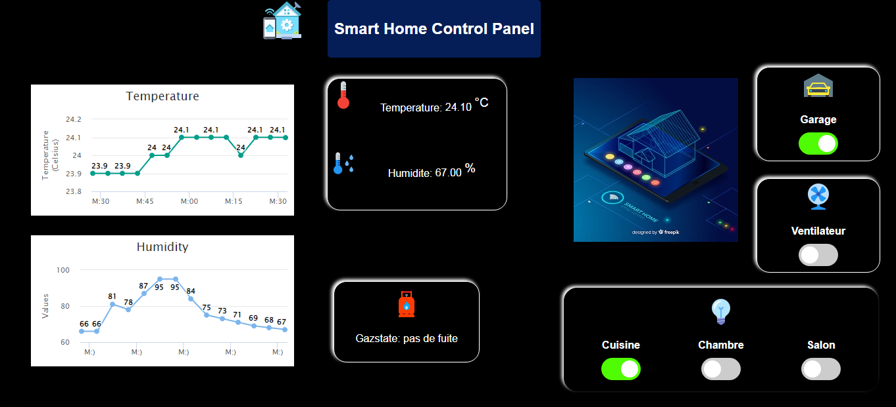
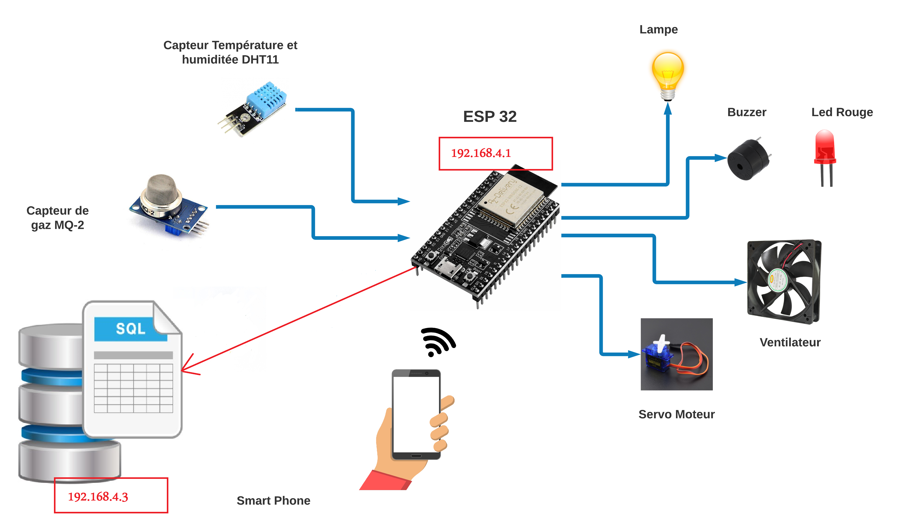
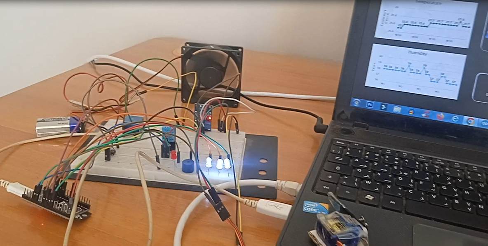
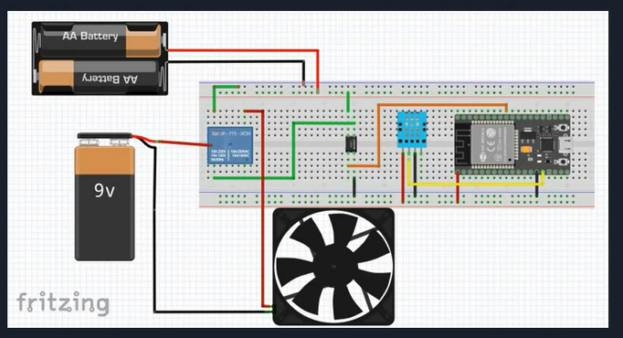
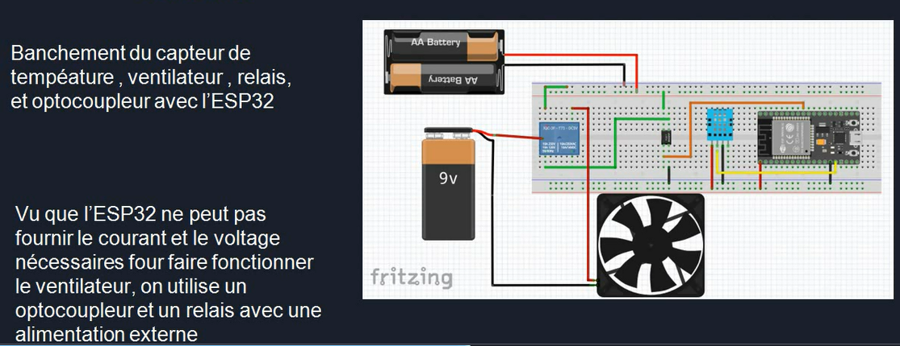
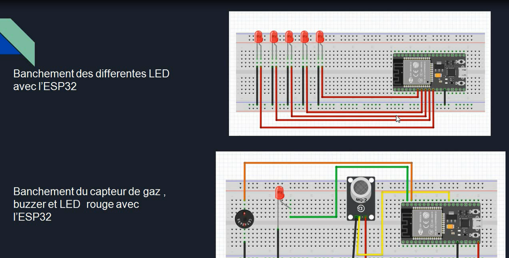
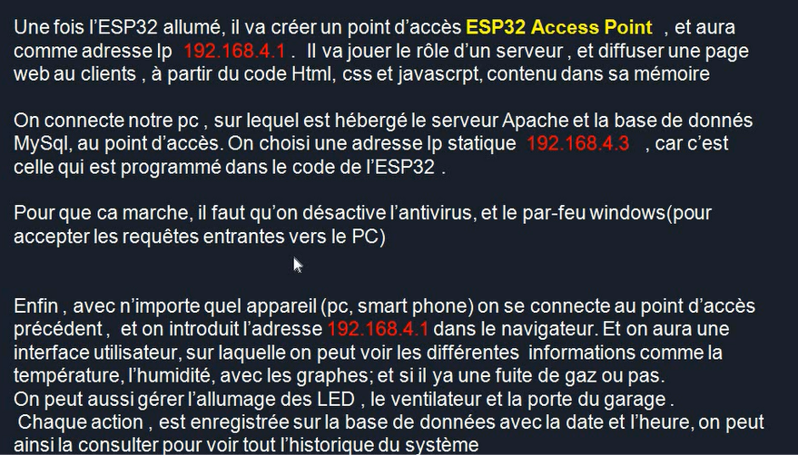
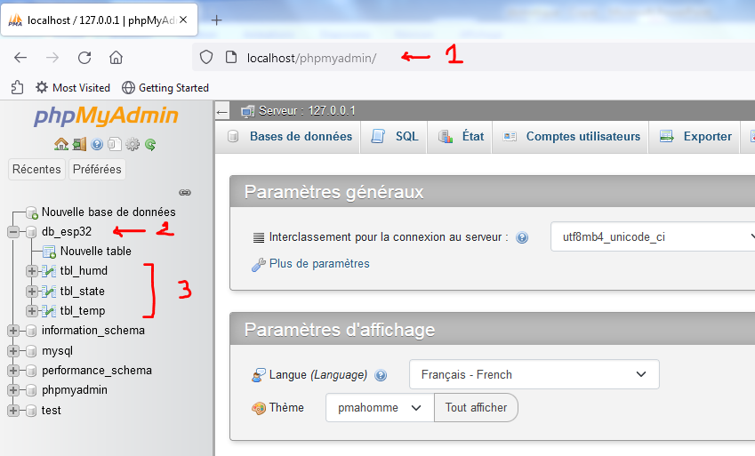
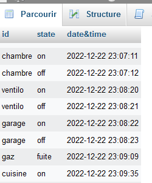
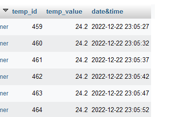

# 🏠 Système Domotique IoT avec ESP32, Dashboard et MySQL (XAMPP)

## Description
Ce projet implémente un **système domotique IoT** basé sur une carte **ESP32** permettant de :
- Collecter des données de capteurs (température, humidité, luminosité, etc.).
- Contrôler des actionneurs (LEDs, relais pour lampes/appareils, etc.).
- Transmettre les données via WiFi vers un serveur local.
- Stocker les données dans une **base de données MySQL** hébergée avec **XAMPP**.
- Visualiser et gérer les informations via un **Dashboard web**.

L’objectif est de fournir une solution simple, évolutive et extensible pour un système domotique intelligent.

---

## Architecture du projet
1. **ESP32** :  
   - Lit les données des capteurs.  
   - Envoie les données (via HTTP ou MQTT) au serveur local.  
   - Reçoit des commandes du dashboard (ex: allumer/éteindre une LED).  

2. **Serveur local (XAMPP)** :  
   - **Apache** : héberge les pages web et l’API PHP.  
   - **MySQL** : stocke les données reçues.  
   - **PHP** : gère la communication entre ESP32 et la base de données.  

3. **Dashboard Web** :  
   - Interface HTML/CSS/JavaScript (optionnellement Bootstrap/Chart.js).  
   - Affichage des capteurs en temps réel.  
   - Contrôle des actionneurs via boutons/toggles.

---
## 🔌 Circuit & Connexions

---
## Fonctionnement

---
## Enregistrement sur la base de données
1. **ESP32** envoie les données des capteurs (ex : température, humidité, luminosité) via une requête **HTTP POST** ou **GET** vers une API PHP.
2. **PHP** reçoit les données et exécute une requête `INSERT` dans la base **MySQL**.
3. Les données sont ensuite affichées dans le **Dashboard** et consultables depuis **phpMyAdmin**.

---
## Technologies utilisées
- **ESP32** (Arduino IDE ou PlatformIO pour la programmation)  
- **WiFi** (protocole HTTP ou MQTT pour la communication)  
- **XAMPP** (Apache + MySQL + PHP)  
- **PHP** (scripts d’API REST pour enregistrer/consulter les données)  
- **HTML, CSS, JS** (Dashboard interactif, possibilité d’ajouter Bootstrap, Chart.js)  

---

