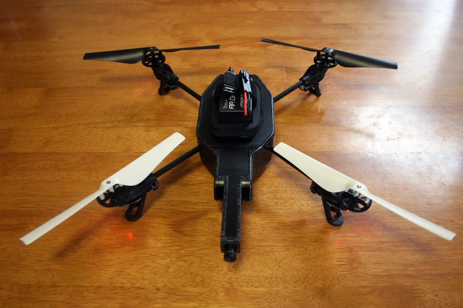
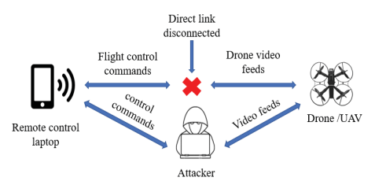
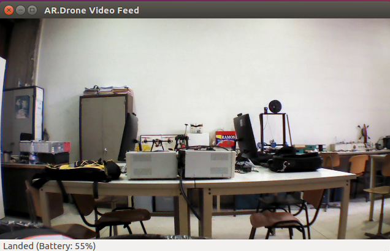
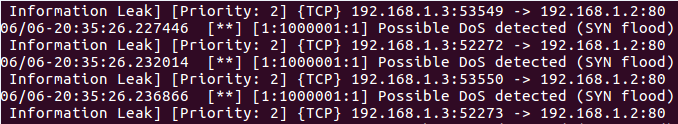

#  Détection & Analyse de Cyberattaques sur Drones IoT
## 🔎 Résumé
Ce projet vise à :
- Observer et collecter des traces (pcap, télémétrie, logs) lors d’événements anormaux liés à des attaques connues (DoS, MITM, deauthentication).
- Définir et tester des méthodes de **détection** et de **prévention** (IDS/IPS, corrélation télémétrie ↔ réseau).
- Produire des rapports, visualisations et recommandations pour durcir les systèmes drone / réseau.

---
## 🎯 Objectifs principaux
1. Centraliser les captures et métadonnées d’expérimentations (étiquetage strict).  
2. Mettre en place un pipeline d’analyse (ingestion → extraction de features → détection → alerting).  
3. Évaluer l’efficacité d’un IDS/IPS (ex. Snort / Suricata) pour **détecter** et **bloquer** comportements malveillants observés.  
4. Fournir des recommandations pratiques de mitigation (hardening, monitoring, procédures d’investigation).

---
## ⚠️ Attaques étudiées (observation uniquement)
- **DoS / Denial of Service** : perturbation de la communication ou du réseau du drone, observée via métriques de connexion et perte de paquets.  
- **MITM / Man-in-the-Middle** : interférences détectables dans les flux de commandes ou télémétrie.  
- **Deauthentication** : instabilités radio et déconnexions massives surveillées via logs et captures réseau.  

---
## 🛡️ IDS/IPS et prévention
- **Outils utilisés** : Snort ou Suricata pour la détection signatures et comportements anormaux.  
- **Rôles** :  
  - Analyse des flux réseau et télémétrie du drone.  
  - Détection d’anomalies (commandes suspectes, flux inattendus, volumes anormaux).  
  - Alerting et reporting via dashboards (Grafana / Kibana).  
- **Objectif** : repérer et **prévenir les incidents** sur le réseau et le drone, avec règles et corrélations adaptées.

